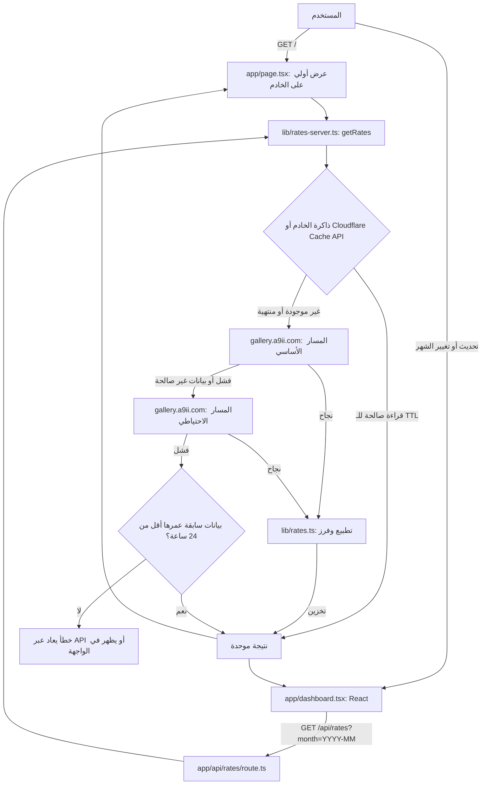

# دولار العراق | Iraq USD

واجهة عربية لمتابعة **سعر صرف الدولار الأمريكي مقابل الدينار العراقي** في أسواق بغداد وأربيل والشمال والبصرة والجنوب، مع عرض أسعار البيع والشراء وتاريخ القراءات. الأرقام الظاهرة في الواجهة محسوبة **لكل 100 دولار أمريكي**، وليست سعر دولار واحد.

> **تنويه:** الأسعار بيانات معلوماتية مصدرها خدمة خارجية، وقد تتأخر أو تتغير. لا يمثل هذا المشروع بنكًا أو جهةً مصرفية رسمية، ولا ينبغي الاعتماد عليه وحده لاتخاذ قرارات مالية.

[المشروع على GitHub](https://github.com/a9ii/usd) · [الترخيص MIT](LICENSE)

## المحتويات

- [نظرة عامة](#overview)
- [المميزات](#features)
- [التقنيات](#tech-stack)
- [بنية المشروع](#structure)
- [التشغيل المحلي](#quick-start)
- [التهيئة](#configuration)
- [مصدر الأسعار وتدفق البيانات](#data-source)
- [توثيق API](#api)
- [التخزين المؤقت والأخطاء](#caching)
- [النشر على Cloudflare Pages](#deployment)
- [SEO والأداء وإمكانية الوصول](#quality)
- [التحقق واستكشاف الأخطاء](#verification)
- [المساهمة والأمان والتراخيص](#contributing)

<a id="overview"></a>
## نظرة عامة — Overview

يجمع **دولار العراق** القراءات التي توفرها خدمة أسعار خارجية في واجهة واحدة موجهة للمستخدم العراقي. بدل عرض قيمة ثابتة، يجلب التطبيق سجل الشهر الحالي، ويستخرج أحدث قراءة لكل سوق، ويقارنها بالقراءة السابقة، ويعرض مخططًا تفاعليًا لمتابعة تغير الأسعار عبر الزمن. يمكن استعراض الأشهر السابقة بحسب ما يتوفر في المصدر، مع إظهار حالات التحميل أو تعذّر التحديث.

يوضح التطبيق **وقت القراءة الوارد من المصدر بتوقيت بغداد**، لا وقت فتح الصفحة أو الضغط على زر التحديث. لا يعني فتح الصفحة أن قراءة جديدة صدرت عن السوق.

<a id="features"></a>
## المميزات — Features

- **أسعار الأسواق:** بطاقات لبغداد، وأربيل والشمال (`north`)، والبصرة والجنوب (`basra`)؛ لكل منها **بيع** و**شراء** بالدينار العراقي مقابل `100 USD`، مع فرق القيمة عن القراءة السابقة إن وُجدت.
- **التحديث:** تحميل أولي من الخادم، زر تحديث يدوي، ومحاولة تحديث تلقائي كل **ساعة** عندما تكون الصفحة مرئية، وكذلك عند عودتها للظهور. تُحدّث الساعة المعروضة داخليًا كل دقيقة لرصد قِدم البيانات.
- **البيانات التاريخية:** الانتقال بين الأشهر حتى الشهر الحالي، واختيار سوق بعينه أو الأسواق الثلاثة، والتبديل بين البيع والشراء، واستكشاف القراءات بالمؤشر أو شريط اختيار القراءة.
- **حالات واضحة:** رسائل للأخطاء وعدم وجود بيانات، وإعادة المحاولة، واستمرار عرض آخر بيانات محمّلة عند فشل تحديثها، مع علامة للبيانات القديمة.
- **تجربة استخدام عربية:** واجهة `RTL` متجاوبة، وضع فاتح/داكن يُحفظ اختياره محليًا في المتصفح، خطوط عربية محلية، أزرار مسماة لقارئات الشاشة ومؤشرات تركيز بلوحة المفاتيح.

> قد لا تتوفر قراءات لجميع الأسواق أو الساعات أو الأشهر. يُعرض الحقل غير المتوفر بشرطة (`—`) بدلاً من اختراع سعر.

<a id="tech-stack"></a>
## التقنيات — Tech Stack

الإصدارات التالية مأخوذة من `package.json` ومقارنة بإدخالات الحزم المباشرة في `pnpm-lock.yaml`؛ ووجود حزمة في الاعتماديات **لا يثبت** استخدامها في ميزة محددة.

| التقنية | الإصدار | دورها المتحقق منه |
| --- | --- | --- |
| React / React DOM | `19.2.6` | بناء لوحة المعلومات والمكونات التفاعلية. |
| Next.js | `16.3.4` | واجهات App Router البرمجية، ومكوّن الصفحة على الخادم، و`Metadata` وRoute Handlers. |
| TypeScript | `5.9.3` | أنواع بيانات الأسعار وفحص الأنواع. |
| Vinext | `1.0.0-beta.5` | تشغيل وبناء تطبيق يستخدم واجهات Next.js عبر مسار متوافق مع Vite. |
| Vite | `8.0.13` | أداة البناء والتطوير المهيأة في `vite.config.ts`. |
| Cloudflare Vite Plugin | `1.37.1` | دمج بيئة Workers ضمن بناء Vite. |
| Cloudflare Pages / Wrangler | Wrangler `4.92.0` | تشغيل مخرجات Pages محليًا ونشرها في **Advanced Mode**. |
| Tailwind CSS / PostCSS | `4.2.1` | التنسيقات ودعم واجهة المكونات؛ مع CSS مخصص في `app/globals.css`. |
| Radix UI | `1.6.7` | مكونات تفاعلية مستخدمة فعليًا، مثل شريط التمرير ومجموعات التبديل والأكورديون. |
| مكونات شبيهة بـ shadcn/ui | ملفات `components/ui/` | مكونات محلية مثل `Button` و`Accordion` و`Slider` و`ToggleGroup`. |
| Lucide React | `1.31.0` | أيقونات الواجهة. |
| ESLint | `9.39.4` | فحص جودة الشيفرة. |

**نقطة معمارية مهمة:** تُستخدم استيرادات `next` لتعريف `Metadata` وبنية App Router، لكن أوامر التطوير والبناء في هذا المستودع **لا تستدعي `next dev` أو `next build` مباشرةً**. يستدعي `scripts/run-framework.mjs` في الوضع المعتاد واجهة **Vinext CLI**، ويهيئ `vite.config.ts` ملحق Vinext وCloudflare. توجد أيضًا شيفرة تنفيذ خاصة ببيئات تطوير مُدارة؛ راجع السكربتات قبل تعديل آلية البناء. المخطط في `components/rate-chart.tsx` مرسوم **يدويًا بـ SVG وReact**، وليس باستخدام `recharts`، رغم وجود الأخيرة ضمن الاعتماديات.

<a id="structure"></a>
## بنية المشروع — Project Structure

الشجرة التالية تُظهر **المسارات الأساسية التي أمكن مراجعة محتواها أو تأكيد الإشارة إليها في الشيفرة**، وليست مخرجات حرفية كاملة لأمر `git ls-files`:

```text
usd/
├── app/
│   ├── api/rates/route.ts       # GET /api/rates
│   ├── robots.txt/route.ts      # GET /robots.txt
│   ├── sitemap.xml/route.ts     # GET /sitemap.xml
│   ├── page.tsx                 # تحميل أولي على الخادم وبيانات JSON-LD
│   ├── dashboard.tsx            # لوحة الأسعار والتحديث والتصفية
│   ├── layout.tsx               # Metadata واتجاه RTL وتحميل الخط
│   └── globals.css             # التصميم والوضع الداكن والتجاوب
├── components/
│   ├── rate-chart.tsx          # مخطط SVG التفاعلي
│   └── ui/                     # مكونات الواجهة المحلية؛ منها button وslider
│                               # وtoggle-group وaccordion
├── hooks/
│   └── use-mobile.ts           # أداة مساعدة لنقطة توقف الأجهزة الصغيرة
├── lib/
│   ├── rates.ts                # الأنواع والتحقق والتطبيع والترتيب
│   ├── rates-server.ts         # مزود الأسعار والتخزين المؤقت
│   ├── site.ts                 # بيانات الموقع وSEO
│   ├── site-deployment.ts      # قيمة تطوير محلية؛ يعيد build:pages توليدها
│   └── utils.ts                # دمج أسماء أصناف CSS
├── scripts/
│   ├── run-framework.mjs       # اختيار مسار التطوير/البناء
│   ├── execution-profile.mjs   # قراءة وضع التنفيذ المحلي
│   ├── build-pages.mjs         # تجهيز مخرجات Cloudflare Pages
│   ├── build-verified.sh       # مسار بناء خاص ببيئة Linux مُدارة
│   ├── install-pnpm.sh         # تثبيت مخصص للبيئة المُدارة
│   └── sites-env.mjs           # تهيئة بيئة Wrangler المحلية
├── build/                     # تكاملات بيئة البناء والعرض المحلي
│   ├── sites-vite-plugin.ts
│   ├── sites-vite-plugin.LICENSE
│   └── sites-worker.ts
├── public/
│   ├── favicon.svg
│   └── fonts/
│       ├── ibm-regular.woff2
│       ├── ibm-semibold.woff2
│       └── OFL.txt
├── .openai/hosting.json        # إعدادات ربط d1/r2 (قيمها الحالية null)
├── .gitignore
├── components.json
├── eslint.config.mjs
├── next.config.ts
├── postcss.config.mjs
├── tsconfig.json
├── vite.config.ts
├── site.config.json
├── wrangler.jsonc
├── package.json
├── pnpm-lock.yaml
├── LICENSE
└── README.md
```

هناك ملفات مساعدة أخرى في `build/` و`scripts/` و`lib/` مرتبطة بتكامل بيئة العرض، ولا تمثل وحدها مميزات جديدة لواجهة أسعار الصرف. يُفضّل تعديل منطق الأسعار في `lib/rates*.ts` وواجهة العرض في `app/` و`components/` لا في ملفات البناء المولدة.

**ملفات تُنشأ أثناء العمل:** `node_modules/` و`dist/` و`pages-dist/` و`.next/` و`.vinext/` و`.wrangler/` (وغيرها من مسارات `.gitignore`). لا تُعدّل نواتج البناء يدويًا. وعلى وجه الخصوص، يكتب `build:pages` ملف `lib/site-deployment.ts` ويستبدل محتواه بعنوان موقع النشر؛ إن كان ضمن الملفات المتتبعة فافحص فرق Git بعد البناء قبل أي commit.

<a id="quick-start"></a>
## المتطلبات والتشغيل المحلي — Prerequisites & Quick Start

- **Git** لاستنساخ المستودع.
- **Node.js `>=22.13.0`** هو الحد الأدنى المعلن في `package.json`؛ يوصى بإصدار **Node.js 24** للتثبيت والبناء والنشر كما تشير إليه تعليمات المشروع الأصلية.
- **pnpm `11.25.0`** وفق حقل `packageManager` وملف القفل.
- اتصال بالإنترنت لتثبيت الحزم وجلب الأسعار. لا تتطلب مشاهدة الموقع مفتاح API بحسب المسار الذي تمت مراجعته.
- حساب **Cloudflare** للنشر فقط، وليس لفتح واجهة التطوير المحلية.

```bash
git clone https://github.com/a9ii/usd.git
cd usd

# بعد تثبيت Node.js 24
npm install -g pnpm@11.25.0
pnpm install --frozen-lockfile
pnpm dev
```

افتح **http://localhost:5173** أو العنوان الذي يظهر في الطرفية. يحدد السكربت منفذ `5173` في وضع التطوير المعتاد؛ وقد يختلف السلوك في بيئة تنفيذ مُدارة. لا تستخدم `npm install` بديلاً عن التثبيت المقفل إذا أردت إعادة إنتاج إصدارات المشروع.

لإجراء بناء الإطار الأساسي فقط (غير حزمة Pages الجاهزة للنشر):

```bash
pnpm run build
```

أما التشغيل المحلي **لمخرجات Pages النهائية** فهو موضح في قسم النشر أدناه.

<a id="configuration"></a>
## التهيئة — Configuration

### عنوان الموقع وSEO

يحمل `site.config.json` حاليًا هذه القيمة في المستودع:

```json
{
  "siteUrl": "https://a0i.me"
}
```

هذه **قيمة تهيئة موجودة في المصدر** وليست عنوانًا عامًا يصلح لجميع النسخ. عند نشر نسخة مستقلة، غيّر `siteUrl` إلى نطاقك النهائي، أو وفّر **`SITE_URL` في بيئة البناء**. يأخذ `scripts/build-pages.mjs` قيمة `SITE_URL` أولًا، ثم `site.config.json` إذا لم تُضبط الأولى.

يجب أن يكون العنوان **أصل HTTPS فقط** مثل `https://YOUR-PROJECT.pages.dev`: بلا اسم مستخدم أو كلمة مرور أو مسار فرعي أو query أو fragment. يتحقق السكربت من هذه الشروط ثم يولّد `lib/site-deployment.ts`، الذي تستخدمه `lib/site.ts` لتحديد Canonical وOpen Graph وJSON-LD وSitemap. **تغيير نطاق المشروع بعد النشر يستلزم إعادة البناء والنشر**؛ تغيير متغير وقت التشغيل وحده لا يحدّث هذه البيانات المبنية مسبقًا.

### Cloudflare

إعداد `wrangler.jsonc` في المصدر:

```jsonc
{
  "name": "iraq-usd-site",
  "pages_build_output_dir": "./pages-dist",
  "compatibility_date": "2026-05-15",
  "compatibility_flags": ["nodejs_compat"]
}
```

عدّل الاسم عند استخدام مشروع Pages باسم مختلف، أو مرر `--project-name` لأمر النشر. يحتوي `.openai/hosting.json` على `d1: null` و`r2: null` في النسخة المفحوصة؛ وجود اعتماديات Drizzle أو ملف تهيئة ربط لا يعني أن التطبيق يتطلب قاعدة بيانات لتقديم الأسعار. لم يُتحقق من وجود ملف `.env.example`، ولا حاجة لاختراع متغيرات سرية.

<a id="data-source"></a>
## مصدر الأسعار وتدفق البيانات — Data Source & Architecture

المزود **الفعلي** المحدد في `lib/rates-server.ts` هو:

```text
https://gallery.a9ii.com/usd/api/rates/history?month=YYYY-MM
```

إذا فشل هذا المسار أو أعاد استجابة غير صالحة، يُجرَّب المسار الاحتياطي على **النطاق نفسه**:

```text
https://gallery.a9ii.com/usd/index.php?route=api/rates/history&month=YYYY-MM
```

**رابط الإسناد المرئي** في تذييل الواجهة هو [iraqborsa.com](https://iraqborsa.com/)، وليس رابط `fetch` الذي يستدعيه التطبيق. لا يثبت الكود وحده ملكية أي من الموقعين أو صفة رسمية للمصدر. لاستبدال **مزود البيانات** غيّر `ROOT` والمسارات في `lib/rates-server.ts`، ثم تأكد من توافق الصيغة أو حدّث `normalizeRates` في `lib/rates.ts`. أما تعديل رابط التذييل في `app/dashboard.tsx` فيغيّر **الإسناد فقط**.

### شكل البيانات ومعالجتها

يتوقع المعالج كائن JSON يحوي `status: "success"` ومصفوفة `data`. يمثل كل عنصر قراءةً بوقت `timestamp` بالشكل `YYYY-MM-DD HH:mm:ss` ووسم `date_label`، وقيم `sell` و`buy` للأسواق `baghdad` و`north` و`basra`. يقبل `normalizeRates` القيم الرقمية أو النصوص التي يمكن تحويلها إلى رقم **موجب ومنتهٍ**؛ وما لا يصلح يصبح `null`. ويستبعد القراءات خارج الشهر المطلوب أو التي لا تحتوي أي قيمة صالحة، ويزيل التكرار بحسب `timestamp` مع الاحتفاظ بالأخير، ثم يرتب القراءات تصاعديًا.

القيم المنقولة إلى المكونات **للدولار الواحد**؛ تضرب الواجهة والمخطط السعر في **100** لعرض وحدة `100 USD`، ويُضرب فرق آخر قراءتين في 100 قبل تقريبه وعرضه. الزمن يُفسَّر بتوقيت بغداد (`Asia/Baghdad` / `+03:00`). لا يفرض الكود تحققًا تقويميًا كاملاً على كل تاريخ أو تحققًا معقدًا لمخطط JSON يتجاوز القواعد المذكورة.

### من طلب الصفحة إلى عرض السعر



عند الزيارة الأولى يستدعي `app/page.tsx` دالة الخادم `getRates(currentMonth())` قبل تمرير `initial` إلى `Dashboard`؛ وعند تعذر الجلب يقدم حالة أولية فارغة ورسالة خطأ. بعد تحميل الصفحة تستدعي الواجهة من المتصفح `/api/rates` عند التحديث أو طلب شهر سابق. لا يطلب المتصفح المصدر الخارجي مباشرةً في هذا المسار.

<a id="api"></a>
## توثيق API — API Documentation

```http
GET /api/rates?month=YYYY-MM
```

| البند | التوصيف |
| --- | --- |
| `month` | **مطلوب** بالشكل `YYYY-MM` مع شهر بين `01` و`12`؛ تطابق شكلي فقط، ولا يُمنع طلب شهر مستقبلي. |
| `200 OK` | الاستجابة الموحّدة `data` و`month` و`stale`، ويُضاف `status: "success"`. قد تكون `data` فارغة. |
| `400 Bad Request` | شهر ناقص أو غير مطابق للشكل: `{"error":"شهر غير صالح"}`. |
| `502 Bad Gateway` | تعذّر جلب بيانات صحيحة من المسارين ولا توجد بيانات مخزنة صالحة للاستخدام الاحتياطي. |
| `Cache-Control` | للنجاح غير القديم: `public, max-age=60, s-maxage=60, stale-while-revalidate=120`؛ وللنتيجة القديمة أو `400`/`502`: `no-store`. |

مثال **توضيحي مختلق، وليس قراءة حقيقية أو مستخرجة من المزود**:

```json
{
  "status": "success",
  "month": "2026-10",
  "stale": false,
  "data": [
    {
      "timestamp": "2026-10-08 12:00:00",
      "date_label": "2026-10-08 12:00:00",
      "baghdad": { "sell": 1510, "buy": 1505 },
      "north": { "sell": 1512, "buy": 1507 },
      "basra": { "sell": 1508, "buy": null }
    }
  ]
}
```

في هذا **المثال فقط** تعرض بطاقة بيع بغداد `151,000` دينار مقابل **100 دولار**؛ لا تغيّر الـ API وحدة الأرقام. ترتيب `data` من الأقدم إلى الأحدث، وتكون القيم غير المتاحة `null`. تتضمن الاستجابة الناجحة أيضًا الترويسة `X-Content-Type-Options: nosniff`.

مثال محلي بعد تشغيل التطبيق:

```bash
curl -i 'http://localhost:5173/api/rates?month=2026-10'
```

المسارات المعرَّفة الأخرى في التطبيق: `GET /` لواجهة الأسعار، و`GET /sitemap.xml` لخريطة الموقع، و`GET /robots.txt` لتعليمات الزحف. ولا تُعد روابط الأقسام `#markets` و`#history` و`#about` مسارات خادم مستقلة.

<a id="caching"></a>
## التخزين المؤقت، قدم البيانات ومعالجة الأخطاء

| المستوى | السياسة المنفذة |
| --- | --- |
| ذاكرة الخادم (`Map`) | **60 ثانية** للشهر الحالي و**900 ثانية (15 دقيقة)** للشهور الأخرى؛ حد أقصى **24** شهرًا مخزنًا، ثم حذف أقدم إدخال. |
| Cloudflare Cache API | يستخدم `caches.default` **إن كان متاحًا**؛ يحاول حفظ مدخل الشهر بترويسة `Cache-Control: public, max-age=86400` (يوم واحد). مع ذلك يفحص عمر `savedAt` عند القراءة ويطبّق مدة الصلاحية حسب الشهر. |
| الطلبات المتزامنة | `pending` يجمع الطلبات المتزامنة للشهر نفسه في Promise واحدة **داخل نسخة الخادم نفسها**، ويزيلها عند الانتهاء. |
| الاتصال بالمزود | مهلة `AbortSignal.timeout(4500)`، أي **4.5 ثوانٍ لكل محاولة مسار**، ثم تجربة المسار الاحتياطي. |
| استخدام البيانات القديمة | بعد فشل المسارين، يمكن إعادة أحدث مدخل محفوظ إذا كان عمره **أقل من 24 ساعة** مع `stale: true`؛ وإلا يُرفع خطأ يترجم إلى HTTP `502`. |
| تخزين HTTP للـ API | `60` ثانية للمتصفح/الكاش الوسيط، و`stale-while-revalidate=120` عند النجاح الحديث؛ `no-store` عند استخدام مدخل قديم أو حدوث خطأ. |
| ذاكرة المتصفح | تحتفظ الواجهة بنتائج الأشهر المطلوبة في `Map` حتى **24** إدخالاً لتخفيف إعادة الطلب داخل الجلسة؛ وهي ليست قاعدة بيانات دائمة. |

**تنبيه:** `stale` في JSON يدل على استخدام مدخل احتياطي قديم في الخادم. كما أن الواجهة تعد القراءة **قديمة بصريًا** إذا تجاوز وقت آخر قراءة **ساعتين** حتى لو كانت `stale: false` من الخادم. عند انقطاع الاتصال يبقى آخر سعر حُمّل في واجهة الشهر الحالي، وتظهر رسالة مع زر إعادة المحاولة؛ وقد يفشل فتح شهر آخر مع رسالة خاصة بالتاريخ.

التخزين في الذاكرة داخل عملية/نسخة تشغيل واحدة؛ لا تفترض مشاركة هذه الذاكرة بين جميع Workers. كذلك استخدام Cache API مشروط بوجوده ونجاح عملياته، وليس ضمانًا عامًا للتخزين في كل بيئة.

<a id="deployment"></a>
## النشر على Cloudflare Pages

يعتمد المشروع على **Pages Advanced Mode** لأن الطلبات الديناميكية وSSR وRoute Handlers تحتاج تشغيل شيفرة الخادم؛ رفع ملفات المصدر أو HTML ثابت فقط ليس بديلاً عن عملية البناء.

### 1. تسجيل الدخول وإنشاء مشروع

```bash
pnpm exec wrangler login
pnpm exec wrangler pages project create iraq-usd-site --production-branch main
```

`iraq-usd-site` **اسم مثال وقيمة التهيئة الافتراضية**، ويمكن استخدام مشروع موجود بدل إنشائه. إذا اخترت اسمًا مختلفًا فراجعه في `wrangler.jsonc` ووسائط النشر. قد يختلف عنوان `pages.dev` الفعلي إذا كان الاسم مستخدمًا؛ اعتمد العنوان الذي تؤكده Cloudflare.

### 2. ضبط العنوان والبناء والنشر

بعد تحديد عنوان مشروعك النهائي في `site.config.json` أو كمتغير بيئة بناء `SITE_URL`:

```bash
# مثال فقط: استبدل العنوان بعنوان مشروعك الحقيقي
SITE_URL='https://YOUR-PROJECT.pages.dev' pnpm run build:pages
pnpm run deploy:pages --project-name iraq-usd-site --branch main
```

الأمر الأول يستدعي `scripts/build-pages.mjs` والذي:

1. يتحقق من أصل HTTPS، ويولّد `lib/site-deployment.ts` بقيمة النطاق المختار.
2. ينفّذ بناء الإطار (`scripts/run-framework.mjs build`).
3. ينشئ `pages-dist/` وينسخ أصول `dist/client` إليها.
4. ينقل وحدات `dist/server` إلى **المجلد** `pages-dist/_worker.js/server/`، وينشئ `pages-dist/_worker.js/index.js` بوصفه مدخل Worker بالصيغة الوحدوية.
5. يوجّه الأصول الثابتة عبر `env.ASSETS.fetch`، وطلبات التطبيق الأخرى إلى معالج الخادم، ويولّد `pages-dist/_routes.json` مع استثناءات `/_next/static/*` و`/fonts/*` و`/favicon.svg`.
6. يحذف ملف Wrangler المؤقت `dist/server/wrangler.json` من نسخة `_worker.js` وملف إعادة التوجيه `.wrangler/deploy/config.json` حتى يُستخدم إعداد Pages الجذري، كما يزيل `.assetsignore` من المخرجات إن وجد.

**لا تعدّل** `pages-dist/` أو محتويات `_worker.js/` أو `_routes.json` المولدة يدويًا؛ أعد البناء عند تغيير المصدر. لا تستخدم `wrangler deploy` بدلاً من سكربت `deploy:pages`: الأمر الموجود في هذا المشروع هو **`wrangler pages deploy pages-dist`**. تأكد من سلامة عمل SSR وAPI بعد الرفع.

### 3. معاينة مخرجات Pages محليًا

```bash
pnpm run build:pages
pnpm run preview:pages --port 8787
```

افتح العنوان الذي يعرضه Wrangler، عادةً `http://localhost:8787`. يجب تنفيذ البناء أولًا. لا يعني نجاح `pnpm dev` وحده أن حزمة Pages ستعمل في الإنتاج.

### 4. GitHub Integration (خيار بديل)

للنشر التلقائي اربط المستودع بمشروع **Pages جديد أنشئ بنمط Git Integration**، ثم اضبط الخيارات التالية:

| إعداد Cloudflare | القيمة |
| --- | --- |
| Framework preset | `None` |
| Build command | `pnpm run build:pages` |
| Build output directory | `pages-dist` |
| Root directory | جذر المستودع، أو مسار المشروع إن كان داخل مستودع متعدد المشاريع |
| `NODE_VERSION` | `24` |
| `PNPM_VERSION` | `11.25.0` |
| `SITE_URL` | النطاق النهائي الصحيح، مثل عنوان `pages.dev` المخصص لهذا المشروع |

**مهم:** وفق توثيق Cloudflare، **لا يمكن تحويل مشروع أُنشئ بنمط Direct Upload إلى Git Integration لاحقًا**؛ لإنشاء تكامل Git تلقائي استخدم مشروعًا جديدًا من ذلك النوع. احرص على مطابقة إعداد `nodejs_compat` وتاريخ التوافق مع `wrangler.jsonc`؛ افحص إعدادات المشروع من لوحة Cloudflare بعد النشر.

مراجع Cloudflare: [Advanced Mode](https://developers.cloudflare.com/pages/functions/advanced-mode/) · [Direct Upload](https://developers.cloudflare.com/pages/get-started/direct-upload/) · [Wrangler Configuration](https://developers.cloudflare.com/pages/functions/wrangler-configuration/).

<a id="quality"></a>
## تحسين محركات البحث والأداء وإمكانية الوصول

### SEO

- `app/layout.tsx`: `title` و`description` و`metadataBase` وCanonical وOpen Graph وTwitter `summary` وبيانات robots و`viewport`.
- `app/page.tsx`: `JSON-LD` بنوعي `WebSite` و`WebPage`، ويتضمن `dateModified` حين تتوفر قراءة حديثة ضمن البيانات المحمّلة. يُستبدل `<` عند تسلسل JSON للحد من إدخال نص غير مرغوب داخل عنصر script.
- `app/sitemap.xml/route.ts`: يرسل خريطة تحوي رابط الصفحة الرئيسية، وقد يضيف `lastmod` من آخر قراءة؛ ترويسة التخزين `max-age=300`.
- `app/robots.txt/route.ts`: يسمح بالزحف إلى الموقع ويستثني `/api/` ويشير إلى Sitemap؛ ترويسة التخزين `max-age=3600`.

اضبط النطاق النهائي قبل البناء؛ `Canonical` أو Sitemap الخاطئان قد يربكان محركات البحث. **لا توجد درجات Lighthouse أو وعود ترتيب في البحث مثبتة هنا**.

### الأداء وتجربة الاستخدام

يستخدم التطبيق SSR لعرض بيانات أولية، وطلب API محليًا للتحديثات، وتخزينًا مؤقتًا متعدد المستويات، وإلغاء طلبات المتصفح التي تجاوزها تحديث أحدث. يعتمد المخطط على SVG بقياس عرض الحاوية عبر `ResizeObserver` وبعرض متجاوب، وتُحمَّل خطوط **IBM Plex Sans Arabic** محليًا بصيغة WOFF2 مع `font-display: swap` وpreload للخط الأساسي. تتضمن CSS نقاط توقف عند `1100px` و`800px` و`370px` ودعم `prefers-reduced-motion`.

لغة جذر الصفحة `ar` والاتجاه `rtl`، مع روابط لتجاوز التنقل، وأسماء مناسبة للأزرار وأدوات التصفية، و`aria-live` و`role="alert"` لحالات الواجهة، وعناوين ووصف للمخطط SVG، وشريط قراءة قابل للتعامل بلوحة المفاتيح عبر مكونات Radix. هذه **إجراءات موجودة في الكود**، وليست شهادة امتثال مكتملة لمعيار WCAG.

<a id="verification"></a>
## الاختبارات والتحقق — Verification

الأوامر المتاحة استنادًا إلى `package.json`:

```bash
pnpm run lint                 # ESLint
pnpm exec tsc --noEmit       # فحص الأنواع عبر TypeScript CLI
pnpm run build               # بناء الإطار
pnpm run build:pages         # بناء حزمة Cloudflare Pages (يستلزم عنوان HTTPS صالحًا)
```

لا يظهر سكربت `test` في `package.json`؛ لذلك **لا يُفترض وجود مجموعة Unit/Integration/E2E تعمل آليًا**. `tsc --noEmit` أمر صالح من أداة TypeScript الموجودة ضمن الاعتماديات، لكنه ليس سكربتًا معرفًا باسم `typecheck` في `package.json`.

بعد النشر، افحص يدويًا:

1. فتح `/` وعرض الأسواق الثلاثة ووحدة **100 USD** والتاريخ بتوقيت بغداد.
2. مسار `/api/rates?month=YYYY-MM` لشهر صالح، ثم استجابة `400` لقيمة غير صالحة مثل `2026-13`.
3. التبديل بين الأشهر والبيع/الشراء والأسواق، وتجربة تحديث السعر وإعادة المحاولة.
4. تشغيل الوضع الداكن وإعادة تحميل الصفحة وتجربة العرض على الهاتف ولوحة المفاتيح.
5. `/robots.txt` و`/sitemap.xml` و`<link rel="canonical">` للتأكد من استخدام نطاقك.
6. فحص Network وLogs في Pages عند ظهور `502`، وتمييز فشل مزود الأسعار من فشل توجيه Worker.

**حدود هذا التوثيق:** أُعدّ استنادًا إلى ملفات الشيفرة العامة التي أمكن قراءتها من فرع `main` وإعدادات الحزم، وليس نتيجة تشغيل اختبارات المشروع في بيئة نشر فعلية. لم تُتحقق نتائج بناء حي أو Lighthouse أو التكامل مع حساب Cloudflare هنا.

### مشكلات شائعة — Troubleshooting

| المشكلة | الإجراء المقترح |
| --- | --- |
| تعذّر تثبيت الحزم أو عدم توافق القفل | استخدم Node.js 24 و`pnpm 11.25.0` ثم `pnpm install --frozen-lockfile`؛ لا تمزج مديري حزم مختلفين. |
| رسالة عن إصدار Node | الحد المعلن `>=22.13.0`؛ حدّث إلى Node 24 الموصى به في تعليمات النشر. |
| فشل `build:pages` بسبب URL | ضع أصل HTTPS صحيحًا في `SITE_URL` أو `site.config.json`؛ دون path أو query أو fragment. |
| `502` عند طلب الأسعار | تحقق من اتصال الخادم بـ `gallery.a9ii.com` وسلامة JSON وحالة المسار البديل؛ قد يكون مزود الأسعار متوقفًا. |
| ظهور بيانات قديمة أو فارغة | راجع وقت قراءة المصدر، وسياسة 24 ساعة للنسخة الاحتياطية، وهل الشهر المطلوب يحوي قراءات؛ جرّب زر التحديث. |
| فشل Wrangler أو صلاحية الحساب | نفّذ `pnpm exec wrangler login`، وتحقق من اسم Pages والفرع ووجود `pages-dist/` بعد البناء. |
| الصفحة تعمل لكن API يفشل بعد الرفع | تأكد من نشر **`pages-dist` كاملة** بما فيها مجلد `_worker.js/` و`_routes.json`، لا الملفات الثابتة وحدها. |
| Canonical أو Sitemap لنطاق آخر | صحّح `SITE_URL` وقت البناء أو `site.config.json` ثم أعد `build:pages` والنشر. |
| تعطل مسار البناء في بيئة Linux مُدارة | راجع `scripts/execution-profile.mjs` و`build-verified.sh` ومتطلبات GNU `timeout`؛ الوضع المحمول يستدعي Vinext مباشرة. |

<a id="contributing"></a>
## المساهمة، الأمان والخصوصية، والترخيص

### Contributing

ارفع نسخة Fork من [المستودع](https://github.com/a9ii/usd)، ثم أنشئ فرعًا لتغيير محدد وراجع الأنواع والتنسيقات الموجودة بدل إدخال أنماط متباينة. شغّل `pnpm run lint` و`pnpm exec tsc --noEmit` و`pnpm run build:pages` في بيئة مناسبة قبل فتح Pull Request، واشرح ما تغيّر وكيف اختُبر. تجنّب تضمين `dist/` أو `pages-dist/` أو مفاتيح وأسرار. لا تعتمد هذه التعليمات على افتراض وجود ملف `CONTRIBUTING.md`.

### Security & Privacy

تقرأ واجهة المتصفح الأسعار من `/api/rates` المحلي، بينما يتواصل الخادم مع مزود خارجي عبر HTTPS؛ لذلك تتوقف حداثة الأسعار على توافر الخدمة وصحة استجاباتها. يتحقق الكود من صيغة الشهر وبعض الحقول والقيم ويستخدم مهلة للطلبات، لكنه لا يقدّم ضمانًا بتدقيق أمني مستقل. يَحفظ اختيار الوضع الداكن فقط بالمفتاح `iraq-theme` في `localStorage` ضمن المسار الرئيسي الذي تمت مراجعته. راجع سياسات الاستضافة وأي خدمات إضافية تُدخلها قبل وصف النسخة المنشورة بأنها خالية من التتبع.

لا تضف بيانات اعتماد إلى Git، ولا تضع الأسرار داخل المتغير `SITE_URL` أو شيفرة العميل. تذكّر أن تطبيق الأسعار والمصدر الخارجي ليسا خدمة مصرفية رسمية مثبتة الصفة.

### License & Credits

- **المشروع:** ترخيص [MIT](LICENSE)؛ إشعار حقوق النشر في الملف: **Copyright (c) 2026 a9ii**.
- **مالك المستودع:** [a9ii](https://github.com/a9ii). هذا لا يثبت ملكية مزود أسعار الصرف.
- **مصدر بيانات التنفيذ:** `gallery.a9ii.com`، كما في `lib/rates-server.ts`؛ **رابط الإسناد الظاهر للمستخدم:** [iraqborsa.com](https://iraqborsa.com/). وهما وظيفتان مختلفتان في الشيفرة.
- **الخط:** IBM Plex Sans Arabic، وفق [SIL Open Font License 1.1](public/fonts/OFL.txt)، مع حقوق IBM واسم الخط المحجوز «Plex» بحسب الملف.
- **أصل مضمّن:** `build/sites-vite-plugin.ts` يشير إلى أصل مقتبس بترخيص MIT، محفوظ في [`build/sites-vite-plugin.LICENSE`](build/sites-vite-plugin.LICENSE).

تتبع بقية المكتبات تراخيصها الخاصة، ويجب مراجعتها عند إعادة التوزيع. لم يُتحقق من وجود تراخيص منفصلة لكل أصل ثنائي آخر في المستودع.
